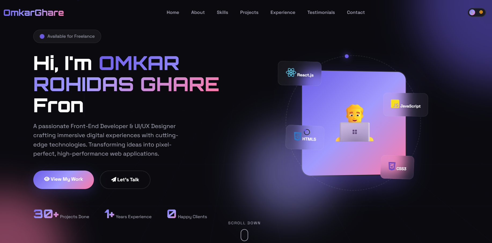

# 💼 Personal Portfolio Website Template — V8

A stylish and responsive portfolio website template built to showcase skills, projects, and creative work with a premium user experience.

---

## 🔥 Features

- Elegant UI Design
- Responsive Across All Devices
- Smooth Page Navigation
- Animated Components
- Projects Gallery
- Professional Layout
- Lightweight & Fast
- Beginner-Friendly Code

---

## ⚙️ Tech Stack

- HTML5
- CSS3
- JavaScript

---

## 📸 Preview Image



---

## 📂 Structure

```bash
├── index.html
├── css
├── js
├── Images
      └── Preview.png
```

---

## 🌍 Use Cases

- Developer Portfolio
- Freelancer Website
- Designer Showcase
- Personal Branding

---

## 👨‍💻 Author

Made with ❤️ by **Omkar R. Ghare**

---

## 📜 License

Open-source project available for learning purposes.
